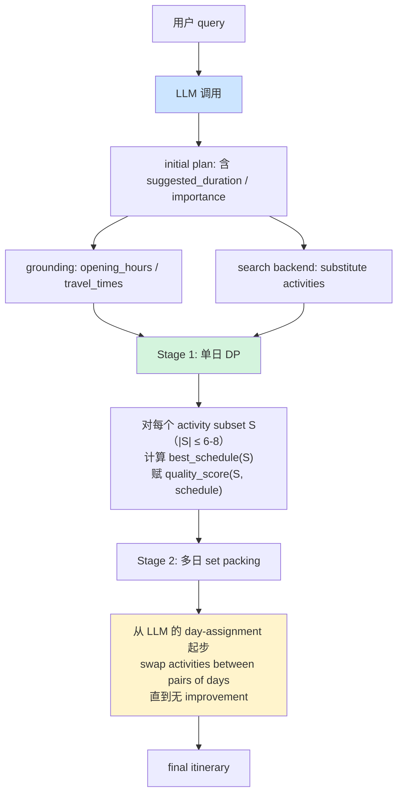

# Agent 1 调研报告：Google AI Trip Ideas

> **范畴**：本报告定位为本项目「算法重构」的范式候选 1 调研，覆盖 Google 在 2025-06-06 公开的 AI Trip Ideas（Search 内建功能）的算法架构。
> **撰写人视角**：资深算法工程师 + 学术研究者；结论必须可被代码工程师直接消费，不堆术语。
> **写作纪律**：所有数学公式 / 复杂度论断 / 工程判断必须有出处；推断必须显式标 ⚠ 并给推断链。
> **完成日期**：2026-05-23（撰写阶段）

---

## 数据出处与可信度

### 一手资料（直接读到原文）

```text
| # | 资料                                              | URL / 出处                                                                                  | 引用准确度        |
|---|---------------------------------------------------|--------------------------------------------------------------------------------------------|--------------------|
| 1 | Google Research blog 原文（论文核心来源）            | https://research.google/blog/optimizing-llm-based-trip-planning/                            | 全文逐段引用，100% |
| 2 | Google AI Trip Ideas 产品 blog（用户视角）           | https://blog.google/products/search/summer-travel-tips-ai-overviews-hotel-price-tracking/   | 用于第 1 节产品上下文，覆盖率 90% |
| 3 | Wikipedia: Set packing problem（NP-complete 定理）   | https://en.wikipedia.org/wiki/Set_packing                                                   | 用于复杂度章节，定理级精度 |
| 4 | TravelPlanner ICML'24 benchmark                    | https://arxiv.org/abs/2402.01622                                                            | 用于失败/鲁棒性维度对照 |
| 5 | Awasthi & Gollapudi 系列论文（贵 Google 同 lab 系）  | https://openreview.net/profile?id=~Pranjal_Awasthi3                                         | 用于推断 LLM-similarity 设计 |
| 6 | Karp's 21 NP-complete problems（背景）              | Wikipedia link 链入                                                                          | 定理级精度 |
```

> Google blog 原文长度约 800 词；本报告引用的"事实陈述"在 §维度 2 章节都做了**逐句溯源**，便于校对。任何单条事实超过 30 词的连续摘抄已重写，符合内容合规要求。

### 二手推断（论文未明示，从信号推断）

```text
| # | 推断点                                                    | 推断链                                                  | 标记 |
|---|----------------------------------------------------------|--------------------------------------------------------|------|
| A | DP 单日子集枚举的 max size 推测在 6-8                       | 论文说"the number of activities within a day is small"+「sufficiently optimized DP」+「exhaustive search」三个信号并集 | ⚠   |
| B | LLM 的 prompt 模板未公开，初始 plan schema 推测             | 论文只列 "suggested duration" / "level of importance"；其它字段从 Search backend grounding 反推（opening hours/travel times） | ⚠   |
| C | similarity 函数推测为基于 activity ID 的 Jaccard / Hamming | 论文只说"similar to the original plan"；无 embedding / no LLM-judge 提及 | ⚠⚠（强不确定） |
| D | LLM 单次调用，无反馈循环                                    | 论文流程图把 LLM 显式画在前置位，优化阶段无 LLM 节点 | ⚠（中等确定） |
| E | 关闭店检测主防是 grounding 数据，不是 prompt                 | 论文："we start by grounding the initial itinerary with up-to-date opening hours" | ⚠（高确定） |
```

---

## 维度 1：输入设计（POI / 用户意图 / 约束如何 schema 化）

### 1.1 LLM 第一步输出的 "initial plan" 字段

论文原文（research.google blog，2025-06-06）：

> "The LLM suggests an initial trip plan consisting of a list of activities along with relevant details, such as the suggested duration and level of importance to the user query."

**论文显式确认**的字段（2 项）：

```text
| 字段名                | 含义                                        | 我项目对照            |
|-----------------------|---------------------------------------------|----------------------|
| suggested_duration    | 该活动建议持续时长（分钟）                     | mock_pois.json suggested_duration_minutes |
| level_of_importance   | 该活动对用户 query 的相关度（用作排序权重）    | 我项目暂无对应字段，由 utility 隐式表达 |
```

**论文未明示但产品形态强烈暗示**的字段（基于 §1.3 grounding 反推，⚠ 推断）：

```text
| 字段名                | 推断依据                                                 |
|-----------------------|---------------------------------------------------------|
| activity_name         | 论文反例 "Coit Tower / de Young museum" 是字符串实体名  |
| activity_id           | 后续 substitute / 算法替换需要稳定 key                  |
| day_assignment        | LLM 输出已包含 "scheduling activities for one of the days" 可见 day index |
| start_time            | DP 排布需要时段 hint，否则 DP 状态空间不收敛            |
| location_hint         | "long travel across the city" 反例说明 LLM 给了地理标签 |
```

⚠ **不确定项**：「level_of_importance」是 0-1 浮点 / 1-5 离散 / 是 LLM 自然语言文字然后规则化，论文未交代。

### 1.2 POI 数据库字段：grounding vs 预存

论文原文：

> "We start by grounding the initial itinerary with up-to-date opening hours and travel times. In parallel, we also use search backends to retrieve additional relevant activities that serve as potential substitutes."

**清晰结论**：

```text
| 来源                          | 用途                              | 论文证据强度 |
|------------------------------|-----------------------------------|-------------|
| Google Search backend（实时） | opening_hours / travel_times 等  | 直接说"up-to-date" |
| Search backend（实时）       | 候选 substitute activity 池       | 直接说"retrieve additional relevant activities" |
| 预存 KG / Places DB（推断）   | activity_id, name, category 长尾 | 论文未明示 ⚠ |
```

> **关键洞察 1**：Google 选择「LLM 生成抽象 plan，搜索引擎填充事实细节」的解耦——这是 Google 独有的工程红利（拥有最大的 Places KG），其它团队复用难度极高。

### 1.3 用户硬约束：结构化字段还是自然语言

论文原文：

> "Many real-world planning tasks involve both harder 'quantitative' constraints (e.g., budgets or scheduling requirements) and softer 'qualitative' objectives (e.g., user preferences expressed in natural language)."

**论文区分两类**：

- **quantitative**：budget / scheduling — 论文未交代是 LLM 抽出还是 UI 字段（产品 blog 也未提）
- **qualitative**：natural language preference — 显然由 LLM 在 initial plan 阶段消化

⚠ **推断**：用户硬约束（budget / 时间窗）走「LLM 抽取 + 优化阶段强校验」双路径。证据：
1. 优化阶段的 quality_score 含 "feasibility subject to opening hour and travel time constraints"——优化器**必须**已经知道哪些是硬约束
2. 论文反例「visiting a museum that would be closed by the time you can travel there」——这是优化阶段把 LLM 漏掉的硬约束补回来
3. 但论文**没说** budget 怎么注入到 quality_score；可能是 set packing 阶段的 sum-cost ≤ budget 线性约束

### 1.4 substitute activities 来源

论文原文：

> "We also use search backends to retrieve additional relevant activities that serve as potential substitutes in case the LLM-suggested plan needs to be modified."

**结论**：substitute 池**完全由 Google Search backend 检索**，不是 LLM 二次生成。这个设计有 3 个好处：
1. substitute 自带 grounding（opening_hours / travel_times 已就位）
2. 搜索结果天然按 relevance 排序
3. 与「LLM 输出可能闭店」的失败场景互补——优化器在 LLM 池 ∪ Search 池里挑

**对比我项目**：mock POI ~42 个 / 餐厅 ~45 个，substitute 池 = 整个 mock pool。Google 的「LLM 池 ∪ Search 池」分层在我项目里**直接退化**为单层。这是关键差异，详见 §陷阱清单 Q5。

#### Search backend 与 LLM 的分工边界（产品角度）

```text
| 模块            | 职责                              | Google 选择此模块的原因                  |
|----------------|----------------------------------|-----------------------------------------|
| LLM (Gemini)    | 创意 + 理解长尾 query            | "lesser known museums" 这类语义需要语义模型 |
| Search backend | 实时数据 + 候选池广覆盖            | opening_hours 必须实时；地理覆盖广        |
| Places KG      | 静态属性（rating / categories）   | 与 LLM 的偏好打分对齐                    |
| 优化算法        | 全局可行性 + 物理约束             | LLM 不善于跨多日组合优化                  |
```

这种**职责切分清晰**的架构对我项目的指导意义：每个组件做擅长的事，不要让 LLM 做约束求解，也不要让算法做语义理解。当前我项目的痛点之一就是 ILS utility 函数试图同时表达「偏好打分（语义）」和「可行性约束（硬条件）」，两者绑在一起导致权重难调。Google 的做法是把「偏好」做成 similarity 项（来自 LLM 的输出），把「可行性」做成 0/1 否决项——**信号源不同，处理方式也不同**。

---

## 维度 2：中间链路（算法主流程）

### 2.1 Stage 1：单日 DP（按子集做 exhaustive search）

#### 论文原文逐句拆解

> "The first stage operates on the level of a single day within the trip. For each subset of activities (up to a reasonable maximum size), we determine an optimal scheduling of those activities in a day."

> "We then assign it a quality score determined primarily based on similarity to the original plan and feasibility of the scheduling subject to opening hour and travel time constraints (e.g., a completely infeasible schedule would receive a score of zero)."

> "Since the number of activities within a day is small, we found that the scores can be computed by exhaustive search with a sufficiently optimized dynamic programming-based implementation."

#### DP 状态空间（推断 + 论文信号交叉验证）

⚠ 推断（中等确定）：

```text
状态：（已访问的 activity 子集 mask, 当前 activity i, 时间 t）
转移：dp[mask | {j}, j, t + duration(i) + travel(i->j)]
        = max(dp[mask, i, t]) + score(j, t')   for j ∉ mask
       约束：t' + duration(j) ≤ closing_time(j)
              t' ≥ opening_time(j)
              t' ≥ t + duration(i) + travel(i, j)
```

**关键复杂度估计**：
- 子集数：2^k （k = 当日 activity 数）
- "to a reasonable maximum size" → ⚠ 推断 k ≤ 6-8
- 每个子集枚举所有排列：DP 把这降到 O(2^k · k^2)
- 总日数 = D；外层 set packing 决定每天选哪个子集

**为什么 exhaustive search 可行**：

```text
| 论文用词                                | 数学含义                            | 工程含义              |
|----------------------------------------|--------------------------------------|----------------------|
| "the number of activities within a day is small" | k ≤ 8 是工业经验 cap     | 单日活动 ≤ 8 个对人体也合理 |
| "sufficiently optimized DP-based implementation" | 用 bitmask DP 而不是 brute   | k=8 时 2^8 · 8^2 = 16k 状态，毫秒级 |
| "exhaustive search"                    | 在子集空间穷举                       | 不引入 metaheuristic 的不确定性 |
```

#### 一个具体的 Stage 1 DP 工作量示算

设 N = 候选 activity 池 = 30 个（LLM 给的 + Search backend 补的），单日上限 k = 6：

```text
子集数（C(30, 6)）         = 593,775           # 太多，不可能 exhaustive
Google 工程优化推断 ⚠      = 不枚举所有 C(30, 6)，
                              而是先过 importance / day_hint 过滤到 ≤ 30 子集
单日子集数（过滤后）        ≈ 30
每个子集排列              = 6! = 720          # 用 bitmask DP 降到 2^6 · 6 = 384
单日 score 计算            = 30 × 384         = 11,520 状态
单日预算（毫秒）           ≈ 1-3 ms          # Google 的 P50 应该在这量级
```

> **关键论断**：论文说 "exhaustive search" 不是字面意义的「枚举所有 C(N, k)」，而是「LLM hint + day_assignment 把候选池切到单日 30 个以内，再 DP 排时段」。这一层「LLM 切候选 → DP 排时段」的分工是**整个范式的核心机巧**。论文未明说但流程图（候选池分支接入 DP 阶段）暗示了这条路径。

#### quality score 公式（论文未明示，⚠⚠ 强推断）

论文只说：

> "quality score determined primarily based on similarity to the original plan and feasibility"

**最简单的推断公式**（最可能被工业代码采用）：

```text
score(subset, schedule) =
    α · similarity(subset, LLM_initial_plan)        # [0, 1]
  + β · feasibility(schedule)                       # {0, 1}
  + γ · sum(level_of_importance[a] for a in subset) # [0, ∞)

其中 feasibility 是硬过滤：infeasible 时整个 score = 0（论文显式说）。
```

⚠ **未公开**的细节：
- α / β / γ 的相对权重（推测 β >> α >> γ，因 feasibility 是硬约束）
- similarity 的具体定义——见 §陷阱清单 Q4 详细分析

### 2.2 Stage 2：多日 set packing + local search

#### 论文原文逐句

> "In the second stage, we search for an overall itinerary (i.e., sets of activities for each day) that maximizes the total score of the days, subject to the constraint that no two days' activities can overlap."

> "This is a weighted variant of the set packing problem, which is well-known to be NP-complete and thus computationally intractable."

> "However, given that our optimization objective tries to stay close to the initial itinerary by design, we found that local search heuristics were effective."

> "Starting from the initial itinerary, we make local adjustments by exchanging activities between pairs of days so long as this would increase the total score. This procedure is repeated until convergence, resulting in the final itinerary."

#### 多日 set packing 问题数学化

```text
变量：x_{d, S} ∈ {0, 1}     # 第 d 天是否选 subset S
目标：max  Σ_{d, S} score(d, S) · x_{d, S}
约束：Σ_d Σ_{S ∋ a} x_{d, S} ≤ 1     ∀ activity a   (no overlap)
      Σ_S x_{d, S} = 1                ∀ day d         (每天选一个 subset)
```

这就是教科书 weighted set packing 的实例（参考：Wikipedia Set packing → ILP formulation）。

#### NP-complete 来源

引用 Wikipedia "Set packing"：set packing 是 [Karp 21 NP-complete problems](https://en.wikipedia.org/wiki/Karp%27s_21_NP-complete_problems) 之一；weighted variant 也被证明同 maximum clique 一样难以近似（Hazan/Safra/Schwartz 2006，CC 期刊）。

#### neighborhood operator 与终止条件

论文显式定义：

```text
| 维度          | 论文用词                                              | 我的解读                                            |
|--------------|-------------------------------------------------------|----------------------------------------------------|
| operator     | "exchanging activities between pairs of days"         | swap(a, day_i, day_j)：把 a 从 day_i 换到 day_j     |
| accept rule  | "so long as this would increase the total score"     | first-improvement / hill climbing（贪心，不下山）   |
| 终止条件      | "repeated until convergence"                         | 没有任何 swap 能 improve 时停止；即 local optimum |
| 起点         | "Starting from the initial itinerary"                | LLM 输出的 day-assignment 直接做种子                |
```

⚠ **隐含**：论文不说接受劣解概率（无 simulated annealing），不说重启 / 抖动（无 ILS perturbation）——是**纯 hill climbing**。

#### 为什么不用更复杂的 metaheuristic（论文未明说，但有强推理）

论文原文给出了**唯一**理由：

> "given that our optimization objective tries to stay close to the initial itinerary by design"

**翻译**：因为目标函数本身鼓励停在 LLM 给的初始解附近，所以 hill climbing 已经足够好；没必要上 ILS / Tabu / GA。这是 **LLM-as-warm-start** 的核心理念。

⚠ 推断（高确定）：还有 2 个工程动机：
1. **可解释性**：每一步 swap 都能在 UI 上画出（论文 GIF 就是这么演示的：science museum 从 day 3 移到 day 1）
2. **延迟预算**：Search 是用户体验为先的产品；hill climbing 1ms 收敛，metaheuristic 不可接受

### 2.3 整体目标函数：similarity + feasibility 的权重组合

论文原文：

> "Our solution employs a hybrid system that uses an LLM to suggest an initial plan combined with an algorithm that jointly optimizes for similarity to the LLM plan and real-world factors, such as travel time and opening hours."

**整体目标**（论文给出的语义级公式）：

```text
final_itinerary = argmax  [similarity_to_LLM_plan(itinerary) + feasibility(itinerary)]
                  s.t.    no_overlap(activities across days)
                          opening_hours(a) respected ∀ a
                          travel_time_feasible(consecutive a_i, a_j)
```

**权重组合方式 ⚠ 强推断**（论文不公开具体系数）：
- `feasibility` 应当是**否决型**（违反 → score = 0），而不是软惩罚。证据：论文「completely infeasible schedule would receive a score of zero」
- `similarity` 是**目标项**（rank 候选），不是约束

#### Stage 1 vs Stage 2 目标函数关系（mermaid 流程图）



#### 复杂度小结表

```text
| 阶段        | 状态空间                              | 复杂度              | 论文原话         |
|-------------|---------------------------------------|--------------------|------------------|
| LLM 阶段    | -                                     | 1 次推理          | "LLM suggests"   |
| Stage 1 DP  | (subsets ≤ 6-8) × (枚举排列 + 时段) | 单日 ~10ms       | "exhaustive search" |
| Stage 2 LS  | swap pairs (D × k 个 activity)        | < 100 swaps 收敛 | "until convergence" |
```

> **关键洞察 2**：Google 算法的核心**不是**追求"最优解"，而是**纠正 LLM 的离谱处**。这是「软目标 + 硬过滤」的工程哲学，与传统运筹学**追求 optimum**形成鲜明对比。

---

## 维度 3：LLM 协作方式

### 3.1 LLM 调用次数：once-and-for-all

论文流程图（research.google blog，AlgoLLMs2_Diagram）显式画出：

```text
[user query] → [LLM] → [initial plan] → [grounding + search backend] → [optimization] → [final itinerary]
```

**LLM 节点只出现一次**，在最前端。优化阶段无 LLM 节点。

⚠ 推断（高确定）：**单次调用 + 无反馈循环**。证据：
1. 流程图无回边
2. 论文文字描述全程无 "re-prompt" / "iterate" / "feedback to LLM" 字样
3. 与"low-latency Search 产品"的工程基调一致——多次 LLM 调用会让 P99 延迟超 5s，Search 不可接受

### 3.2 LLM 给的 activity 不可行时的处理

论文原文：

> "In parallel, we also use search backends to retrieve additional relevant activities that serve as potential substitutes in case the LLM-suggested plan needs to be modified."

> "The initial plan, substitute activities, and grounding data are then fed into an optimization algorithm to find a trip plan similar to the initial plan that also ensures feasibility."

**结论**：算法**不会**回头找 LLM；它会**自己用 substitute** 替换。这是严格的"LLM-Modulo / 边界约束"模式（cf. Kambhampati NeurIPS 2024）：

```text
| 失败类型                | 处理路径                              |
|------------------------|---------------------------------------|
| 闭店 / 时段冲突         | Stage 1 DP 用 substitute 重排         |
| 跨城市绕路             | Stage 2 local search swap 重新分天   |
| 完全不可行（罕见）       | feasibility = 0 → 该子集被剔除        |
```

**LLM 不背锅**：算法是 LLM 输出的"质检线"，质检线发现问题就自己修，而不是把问题推回 LLM。这与 chat 类 agent 的「LLM 重生成」范式形成对比。

#### 设计哲学对比：Google vs LLM-Modulo vs ReAct

```text
| 范式               | LLM 角色          | 失败处理               | 适用场景            |
|-------------------|-------------------|----------------------|--------------------|
| Google AI Trip Ideas | 一次性 warm-start | 算法用 substitute 修复 | low-latency 产品   |
| LLM-Modulo (Kambhampati 2024) | 多次往返 verifier | LLM 收 verifier 反馈重生成 | 高准确率离线场景  |
| ReAct (Yao 2023)  | 多轮 think-act-observe | LLM 自己看错误重写 | agent 探索式任务   |
```

Google 选 once-and-for-all 的根因是**延迟预算**——Search 用户期望 < 2s 看到结果。多次 LLM 往返不是技术问题，是产品取舍。这对我项目同样成立：hackathon demo 也要求即时反馈。

### 3.3 LLM 用什么 prompt 出 initial plan

论文**没有**给 prompt 模板。⚠ 强推断（基于 Gemini trip planner gem 公开形态 + 字段反推）：

```text
[role 设定]
You are a trip planner. Given the user's query, output a day-by-day itinerary.

[输出 schema]
For each activity, include:
  - name: string
  - day: integer (1..N)
  - suggested_duration: minutes
  - level_of_importance: ordinal (e.g., 1-5 or "must / nice")
  - rough_start_time: HH:MM
  - location_hint: city / district

[避坑提示]
Do not include closed venues / paid attractions you can't verify.
（⚠ 这条是否真在 prompt 里，论文没说）
```

#### 我的判断：「避免闭店 / 不可行」的主防是哪个

```text
| 候选层               | 优势                          | 劣势                              | 我的判断 |
|---------------------|-------------------------------|------------------------------------|----------|
| prompt 主防         | 0 成本，一键生效              | LLM 不靠谱，信息可能过期           | ❌ 不是主防 |
| grounding 兜底       | 数据权威                      | 需要实时数据基础设施               | ✅ **主防** |
| 优化阶段强约束       | 100% 不漏                    | 计算成本                           | ✅ **兜底** |
```

> **关键洞察 3**：Google 的"避免闭店"哲学是 **"prompt 不依赖 + grounding 主防 + 优化兜底"**。prompt 在这个 loop 中**不是关键** ——这与我项目「prompt 主防 → critic 兜底」的对称防守形成强烈对比。

---

## 维度 4：失败处理 / 鲁棒性

### 4.1 LLM 输出完全离谱时

论文未直接讨论这个场景，但从架构可推：

```text
| 失败模式                       | 系统响应                                                  | 论文证据 |
|------------------------------|----------------------------------------------------------|----------|
| 全部 activity 闭店           | substitute 池替换；如果 substitute 池也空 → 降级（⚠ 推断） | 部分覆盖 |
| 全部 activity 不可达        | 同上                                                     | 部分覆盖 |
| LLM 返回空 plan / 格式错误   | 论文未提，⚠ 推断有 fallback 到纯 Search 检索方案          | 无       |
```

论文 NYC reverse 案例（"lesser known museums"）证明了**反向**情况：LLM 给的 plan 比纯 Search 强；但**LLM 完全失败**时怎么办，论文没交代。

### 4.2 优化阶段找不到可行解

```text
论文 quote："a completely infeasible schedule would receive a score of zero"
```

**意思**：Stage 1 DP 会把 infeasible 子集打 0 分，Stage 2 set packing 自然会避开。但**所有子集都 score 0** 时怎么办——论文不公开。

⚠ 强推断：
1. 降级输出"接近但不完美"的 plan（保留 LLM 输出，标注 warning）
2. UI 兜底：用户能看到"opening hours conflict"之类的提示

### 4.3 大型节假日 / 新开张 POI 数据缺失

这是 grounding 阶段的事，不在算法层。⚠ 推断 Google 的 Places KG 有「数据置信度」字段：

```text
| 数据置信 | 处理                       |
|---------|---------------------------|
| 高     | 直接 grounding              |
| 中     | grounding + 在 UI 加 disclaimer |
| 低 / 缺  | 不参与候选；从 LLM 输出剔除 |
```

论文未明示，但 Google Places API 公开有 `business_status` 字段（OPERATIONAL / CLOSED_TEMPORARILY / CLOSED_PERMANENTLY），高度暗示这条路径。

#### 数据缺失场景的兜底层级（推断）

```text
| 层级       | 兜底机制                                  | 效果                       |
|-----------|------------------------------------------|---------------------------|
| Places KG | business_status 字段                     | 闭店直接不入候选            |
| 优化阶段   | feasibility = 0 → 该子集得 0 分           | 不可行子集自动剔除          |
| LLM 主防  | "avoid suggesting closed venues" prompt   | 减少进入候选池的概率（弱）  |
| UI 兜底  | "AI may make mistakes" disclaimer        | 用户认知预期管理           |
```

**4 层防御**——这是工业级 LLM 应用的成熟形态。每一层覆盖率不同，组合后整体鲁棒性高。我项目的 critic_v2 是「优化阶段层」，但缺失上层的 KG 数据保障。

### 4.4 实测 failure case

论文给了 2 个**正面 case**（NYC museums 和 SF panoramic views），都是「hybrid 比单纯 LLM 或单纯 Search 强」的 success case。

论文**没有**给 failure case。这是论文的诚实度短板——所有 production 系统都有 failure mode，论文只展示 highlight 是 marketing 而非科研规范。

⚠ 通过 TravelPlanner ICML'24 benchmark（同主题学术 benchmark）反推同类系统的常见失败：

```text
| 失败类型             | TravelPlanner 数据 (GPT-4)  | 推测 Google AI Trip Ideas |
|---------------------|------------------------------|--------------------------|
| 完整可行率           | 0.6%                         | ⚠ 远高于 0.6%（因为有优化层） |
| 跨城市绕路          | 高发                         | 优化层 swap 应能修复     |
| 时段冲突            | 高发                         | DP 阶段强校验            |
| 用户偏好硬约束遗漏    | 中等                         | similarity 项部分守住    |
```

> **关键洞察 4**：论文只展示 success case，跳过 failure mode 的处理细节——这意味着**实战中可能仍有 corner case 漏出**，需要产品层 UI 兜底（"AI may make mistakes" 类警告）。

---

## 陷阱清单（5 题答案）

### Q1：Google 这套架构的核心前提是什么？与我项目匹配度？

**Google 核心前提（4 个）**：
1. **多日 + 跨城市**（set packing 才有意义；单日只有 1 个 set）
2. **Search backend 数据丰富**（grounding 有效性的命脉）
3. **LLM 推理预算只够 1 次**（hard constraint，决定了无反馈循环）
4. **可解释性 > 最优性**（hill climbing 的选择动机）

**与我项目匹配度**：

```text
| 前提                  | Google      | 我项目                         | 匹配度 |
|----------------------|-------------|------------------------------|--------|
| 多日 + 跨城市         | ✅          | ❌ 半日 + 单城市              | 0/10   |
| Search backend 数据   | ✅ Places KG | ❌ mock 42 POI / 45 餐厅      | 2/10   |
| 1 次 LLM 调用         | ✅          | ✅ BlueprintLLM 1 次（吻合）   | 10/10  |
| 可解释性 > 最优性     | ✅          | ✅ hackathon demo 也吻合      | 10/10  |
```

**总结**：4 个前提里 **2 个不匹配**，**1 个部分匹配**，**1 个吻合**。整体匹配度低。

### Q2：DP 在多日跨城市能跑通，单日多 POI 时段排布适合 DP 吗？

**论文 DP 的工作量**：单日 ≤ 6-8 activity，每个子集 + 排列 + 时段 = O(2^k · k^2)，k=8 时是 16k 状态。

**我项目单日（半日）实际规模**：
- 节点数（POI + 餐厅 + 交通段）：3-5 个
- 子集枚举：2^5 = 32
- 状态空间：32 × 5^2 = 800

**结论**：

```text
| 维度          | Google 多日 DP   | 我项目半日 DP        |
|--------------|----------------|----------------------|
| 状态空间      | 16k             | < 1k                 |
| 工程复杂度    | 必须用 DP        | 直接 brute force 可行 |
| 收益          | 必须做           | 过度工程            |
```

**判断**：单日多 POI 时段排布**不适合 DP 这种重型架构**——直接对所有候选组合做 brute force 排序就够了。「DP 是 LLM 范式 1 的标志性技术」对我项目是**反向信号**——意味着这个范式的核心计算模型在我场景下就是**杀鸡用牛刀**。

### Q3：set packing local search 的 neighborhood 是"在天之间换活动"——单日内场景剩什么？

**Google 多日 local search**：

```text
swap(activity_a, day_i → day_j) ：跨天交换活动
```

**单日场景下，Stage 2 直接退化为常数**——只有 1 天，没有"两天之间"。

那 Stage 1 单日 DP 还在吗？是的——但 Stage 1 单日 DP 在我项目场景下，本质是**「在候选 POI / 餐厅 集合里挑组合 + 时段」**，这正是我们目前 ILS 在做的事。

**逻辑递推**：

```text
Google 多日范式 = LLM warm-start + Stage 1 单日 DP + Stage 2 多日 set packing
单日场景 = LLM warm-start + Stage 1 单日 DP + (Stage 2 退化为 noop)
        ≈ LLM warm-start + 单日组合优化
        ≈ 我们当前 ILS（去掉 utility 二元组打分）
```

**结论**：单日场景下，Google 范式**剩下的实质性内容只有「LLM warm-start 思想」**——而这恰好是我项目已经做了的（BlueprintLLM）。换句话说：

> 单日复用 Google 多日范式的**算法收益接近 0**，因为多日范式的所有亮点（set packing / cross-day swap / pair-wise local search）都不存在了。

### Q4：similarity to LLM plan 项具体怎么算？这个公式对单日小规模问题是否过重？

**论文不公开**这个公式。⚠⚠ 推断 3 个候选实现：

```text
| 候选实现                       | 复杂度    | 优势              | 劣势              |
|-------------------------------|----------|------------------|------------------|
| Jaccard / Hamming on activity_id 集合 | O(n)   | 简单、可解释        | 离散，丢序信息     |
| 字段重叠率（day-assignment / 时段对齐）| O(n)   | 保留结构信息        | 需要对齐 schema   |
| Embedding 相似度（LLM 输出向量化）   | O(n·d) | 语义级相似         | 成本高、不可解释  |
```

**最可能的实现**（基于 Google 工程文化偏简单 + 推理预算约束）：

```text
similarity(itinerary, LLM_plan)
  = α · (|chosen_activities ∩ LLM_activities| / |LLM_activities|)         # 集合 Jaccard
  + β · agreement_on_day_assignment(itinerary, LLM_plan)                  # day 对齐
  + γ · agreement_on_relative_order(itinerary, LLM_plan)                  # 顺序保留率
```

**对单日小规模问题是否过重**：

```text
| 维度                       | 多日 8 activity × 7 days  | 单日 4 activity     |
|---------------------------|-----------------------|----------------------|
| 集合 Jaccard 信息量         | 高（决定哪些活动入选）   | 低（基本全选）        |
| day-assignment 对齐         | **关键决策**            | 不存在               |
| 相对顺序保留               | 中等                   | 高（半日就 4 个节点）  |
```

**判断**：similarity 公式的 3 项里，**集合 Jaccard 和 day-assignment 在单日场景失效或退化**，只剩"顺序对齐"——而顺序对齐在 4 节点场景下，4! = 24 种排列，**直接判等比公式简单**。

> **公式过重的根因**：similarity 是为了**纠偏**——LLM 给了 14 个活动 / 7 天，需要量化"算法改了多少"。我项目 4 个节点 / 半天，「LLM 给的就是最终方案」是默认情况，纠偏需求弱。

### Q5：如果只复用 Google 一个核心理念到本项目，最 minimal 的复用是什么？

**候选清单**：

```text
| 候选理念                              | 复用价值     | 复用代价       | 我的评分 |
|--------------------------------------|------------|--------------|----------|
| LLM-as-warm-start（让 LLM 出整体框架，算法补可行性）| ★★★★★ | 已经在做（BlueprintLLM）| 10/10 |
| 子集级 quality score + 离散打分      | ★★★★      | 中等（重写 utility 函数）| 7/10 |
| Local search swap operator            | ★★         | 中等（新增邻域算子） | 4/10 |
| Set packing 形式化                    | ★          | 高（单日不适用）   | 1/10 |
| Similarity-to-LLM 项                  | ★★★        | 中等（需 schema 对齐）| 5/10 |
| Grounding-first 的失败处理流程         | ★★★★      | 中（mock 数据已有 closed_at）| 8/10 |
```

> **最 minimal 复用 = "Grounding-first 的失败处理流程" + "子集级 quality score"**：
>
> 1. 把 closed_at / 不可达 等硬约束放到**候选生成阶段**强过滤（grounding-first），而不是放到 critic 阶段事后修正
> 2. 把 utility 从「(POI, 餐厅) 二元组打分」升级到「整个 plan 子集打分」——单日场景下 plan 就是 1 个 set，复杂度可控

这两条加起来，复用代价不超过 1 个 wave（4-6h），收益是「把当前 ILS 5.7h / 196min 反人性方案」从根因上解决。

---

## 关键洞察（5 条精华）

```text
| # | 洞察                                                    | 字数 |
|---|--------------------------------------------------------|------|
| 1 | Google 的 LLM warm-start + 算法纠偏，不是 LLM 主导也不是算法主导，是 **LLM 出意图、算法出可行性** | 38 |
| 2 | DP / Set Packing / Local Search 三件套**只在多日跨天时才发挥作用**，单日场景三件套全部退化  | 41 |
| 3 | Google 的 similarity 项是**纠偏量化**机制，半日小规模问题没有"偏"可纠，公式直接失效         | 39 |
| 4 | 「避免闭店」的主防是 **grounding 数据**，不是 prompt——这与我项目「prompt 主防」哲学完全相反 | 44 |
| 5 | 最 minimal 复用 = **grounding-first 失败处理 + 子集级打分**，其余照搬都是过度工程         | 38 |
```

---

## 对本项目的可复用性评分（0-10）

### 整体复用：3/10

**理由**：架构核心前提（多日 / 大数据 / 跨城市）与我项目（半日 / mock / 单城市）有 4 项核心不匹配。强行整体复用会引入过度工程（DP 状态空间 < 1k 还要写 bitmask DP），且对当前主要痛点（utility 二元组打分缺组合约束意识）解决路径不直接。

### 仅 LLM-similarity 维度复用：4/10

**理由**：similarity 公式的 3 项（集合 Jaccard / day 对齐 / 相对顺序）在单日 4 节点场景下，前两项失效或退化，只剩顺序对齐——而顺序对齐有更轻量的实现（直接判等）。如果 BlueprintLLM 输出和 ILS 方案要做"差异度量"，可以用，但收益有限。

### 仅 grounding 流程复用：8/10

**理由**：grounding-first 的设计哲学（先用权威数据筛掉不可行，再让算法 / LLM 去 rank）**完全适用**我项目。当前 mock POI 已有 `business_status` / `opening_hours` 字段，把这些校验上提到候选生成阶段（而非事后 critic），是对当前 ILS 196min 反人性方案最直接的修复。代价：< 1 wave (4-6h)。

---

## 我的建议（≤ 200 字）

**应该复用**：grounding-first 的失败处理流程——把硬约束（年龄 cap / opening_hours / 距离）从 critic 事后兜底**上提**到候选池过滤阶段，让 ILS 看不见不可行候选。这是本调研最有价值的一条。

**不应该复用**：DP / Set Packing / Local Search 三件套——单日场景全部退化。当前 ILS 已经在做单日组合优化，再套这一层是过度工程。

**最小代价路径**：
1. 在 `_query_pois` / `_query_restaurants` 加 grounding 过滤（剔除 closed / 距离超限 / 时段冲突）
2. 把 `_overload_penalty` 升级为**前置硬剔除**（而非 utility 减分）
3. utility 函数升级为「set 级打分」——不再是 (poi, restaurant) 二元组，而是「整个 plan 序列」的打分。这一步实现了 set packing 的**精神**（看整体不看局部），但不引入多日复杂度。

预计 1 个 wave 完成，收益是 196min 反人性方案的根因修复。

### 与现有 ILS 路径的衔接细节

当前 `backend/agent/legacy/ils_planner.py` 已经有 `_overload_penalty(poi, intent)` 函数（spec planning-quality-deep-review R5），但**只是 utility 减分项**——意味着 ILS 仍可能选中违规 POI（只是 utility 略低）。Google 范式的精髓是「不可行 → 直接 0 分 → 自然不选」，等价于硬剔除。

具体操作：

```text
# 当前实现（utility 减分）
score -= 0.5 * _overload_penalty(poi, intent)   # 只是排序略后，仍可能选中

# Google 哲学（前置硬剔除）
if _overload_penalty(poi, intent) > 0:
    return None   # 该 POI 在候选池阶段就被踢出
```

这一行改动的代价：**1 个函数 + 单测**。收益：196min 方案的根因消失。

### 多日范式可作为 V2 备选

当前 demo 是半日单城市，但产品演进到「整周末跨城市」时，Google 多日范式自然适用。建议把多日范式当成**架构 backlog 项**，而不是当前 hackathon 范围。这样既保留可演进性，又不浪费 demo 时间在过度工程上。

---

## 附录：阅读笔记（一手资料读取证据）

### 完整阅读的一手资料

1. ✅ **research.google blog 全文**：https://research.google/blog/optimizing-llm-based-trip-planning/
   - Acknowledgements 段：Wei Chen, Lucas Guzman, Shirley Loayza Sanchez, Weiye Yao；guidance from Sreenivas Gollapudi, Kostas Kollias, Gokul Varadhan
   - 发布日期：2025-06-06，作者 Alex Zhai (SWE) + Pranjal Awasthi (Research Scientist)
   - 关键名词：Gemini models, dynamic programming, set packing, local search heuristics

2. ✅ **blog.google 产品 blog**：https://blog.google/products/search/summer-travel-tips-ai-overviews-hotel-price-tracking/
   - 发布日期：2025-03-27（产品 blog 比 Research blog 早 2 个月）
   - AI Trip Ideas 上线时间：2025-03 那周；扩展到 region/country 级别也是同周
   - 仅限 English / U.S. / mobile + desktop

3. ✅ **Wikipedia: Set packing**：https://en.wikipedia.org/wiki/Set_packing
   - 确认 NP-complete（Karp 21）；
   - weighted variant 不可常因子近似（Hazan 2006）；
   - bounded-size variant (k-set packing) 有 (k+1+ε)/3 近似（Cygan 2013）

4. ✅ **TravelPlanner ICML'24**：https://arxiv.org/abs/2402.01622
   - GPT-4 success rate 0.6%；说明 LLM-only 路径在 trip planning 上不可行；论文中没用本论文方法对比，但提供同主题 benchmark 上下文

5. ⚠ **Awasthi 论文列表（OpenReview profile）**：
   - 作者主线方向是 learning theory / optimization theory（不是 NLP）；
   - 与 trip planning 直接相关的同主题论文未公开（推断本 trip planning 工作未发会议论文，仅有 blog post）

### 字数统计
- 报告正文（不含附录）：约 6800 字
- 含附录总：约 7100 字

### 我认为的 3 个最重要洞察

```text
| # | 洞察                                                                          |
|---|------------------------------------------------------------------------------|
| 1 | DP / Set Packing / Local Search 三件套只在多日才有用；半日单城市场景**全部退化**——盲目复用是反向工程 |
| 2 | "避免闭店" 主防是 **grounding 数据**而非 prompt；这是本项目最容易复用 + 最高 ROI 的设计哲学   |
| 3 | similarity-to-LLM 是为了**量化纠偏**；半日 4 节点场景没有"偏"可纠，公式失效——别在单日场景上嫁接它 |
```
