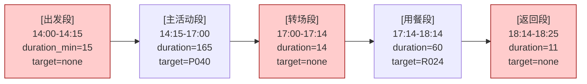
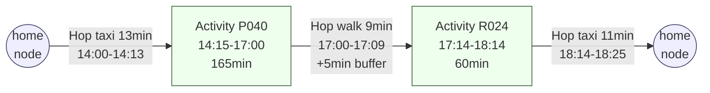

# Design Document: itinerary-edge-model-refactor

> **范围**：High-Level Design（业务层 / Diagrams & Interfaces） + Low-Level Design（技术层 / Code-First）
> **语言**：Python 3.11 + Pydantic v2（后端） / TypeScript（前端）
> **项目模式**：hackathon / demo（评审周内完成；已有 LangGraph 拓扑保留，只换数据模型）
> **现状**：MVP-2 95% / Phase 0.20 LangGraph 主架构已上线 / 现 demo 死循环根因待修

## Overview

把行程数据模型从「Stage（含通勤过程段）」重构为「Activity Node（节点）+ Hop（边）」模型。

**根因**：现状 `ItineraryStage` 一个字段被 LLM、critic、前端三方各自解读：LLM 把「出发」段的 `duration_min` 当成通勤过程时长；critic 把它当成「在 home 待 N 分钟」再额外要求段间通勤；前端把它和主活动段渲染成同样大小的时间块。结果就是 prompt 怎么改 critic 都过不了，触发 ILS 死循环。

**思路**：业内（Google Trips / Apple Maps / 携程）都用「节点 + 边」建模——节点表达「在哪干啥、停留多久」，边表达「A→B 怎么过去、几分钟」。`mock_data/routes.json` 本来就是 edge 表，把它强行塞进 `stage.duration_min` 是反模式。重构后单一真理源：节点有时长、边有时长、总跨度 = ∑节点 + ∑边，三方组件不再各算各的。

**hackathon 时间盒**：保留 LangGraph 拓扑 + critics_v2 + LLM-Modulo 闭环；只换 schema + assemble + critic 的语义，前端 v1 仍按时间轴渲染（不强求拆 hop 卡片）。

---

## Architecture

### 概念模型对比（High-Level Design）

#### 现状（Stage 模型，反模式）



红色段（出发/转场/返回）是「过程类段」，`target=none`、`duration` 实际表达通勤时长。三方语义漂移：

```
| 视角     | 「出发段 duration=15」的语义                   |
|---------|----------------------------------------------|
| LLM     | home → P040 通勤 15 分钟                      |
| critic  | 在 home 停留 15 分钟，然后再额外算 home → P040 通勤 |
| 前端    | 一个时间块「出发 14:00-14:15」（与主活动等大）  |
```

#### 新模型（节点 + 边）



- **Node**：用户「在某个地点做某件事」。home 节点也是节点（不是「出发段的副产物」）。
- **Hop**：两个节点之间的位移过程。可以是步行/打车/公交/虚拟（同地复用时 minutes=0）。
- **总跨度** = first_hop.start → last_node.end。三方组件读到的是同一份事实。

**最关键的语义反转**：原来「出发段 duration=15 表达通勤」→ 现在「Hop(home→P040) minutes=13 表达通勤；node(home) 不存在停留时长这一回事」。

### 节点-边状态机

**确认采用：n nodes ↔ n-1 hops，且首尾必须为 home 节点。**

```text
nodes = [home, A, B, ..., Z, home]
hops  = [home→A, A→B, ..., Z→home]
```

理由（按重要性排序）：

1. **闭环对称**：home→A 和 Z→home 都是真实通勤过程，作为 Hop 表达；不是「出发节点」「返回节点」这种语义噪音
2. **n 与 n-1 的不变量**：所有 critic / 前端 / SSE 消费方只需断言 `len(hops) == len(nodes) - 1`，不需要根据「是否含 home 出发」分支
3. **同地复用自然支持**：连续两段在同一 POI（如 A → A，先逛后逛）→ 中间塞一条 `minutes=0 / mode=virtual / path_type=in_place` 的 Hop，nodes 仍 2 个、hops 仍 1 个，不破坏不变量
4. **home 节点的 duration_min = 0**：home 是抽象起终点，不表达「在家停留」，duration 写 0；前端可隐藏不渲染
5. **特殊场景例外（v1 不做）**：仅含 1 个 home（用户原地不动）→ nodes=[home]，hops=[]——理论合法但 v1 不会出现，留 invariant 不实现

> 单段方案（如「只想吃饭」）→ nodes=[home, R024, home]，hops=[home→R024, R024→home]，3 个节点 2 条边，与「只在家不出门」零节点路径不冲突。

#### 同地复用

LLM 输出连续两个相同 target_id 的 node（如：在某综合体先看展再吃饭）：

```text
nodes = [home, MallA(看展, 14:00-15:30), MallA(用餐, 15:30-16:30), home]
hops  = [home→MallA, MallA→MallA(in_place, 0min), MallA→home]
```

- 第二条 hop `mode=virtual / path_type=in_place / minutes=0`
- critic 跳过 `_check_hop_feasibility`（minutes=0 永远可达）
- 前端隐藏渲染（schedule 派生视图给 hop 标 `hidden=true`）

### 三方组件视角统一

```
| 组件             | 现状看到什么                              | 新模型看到什么                                  |
|-----------------|------------------------------------------|------------------------------------------------|
| LLM 蓝图         | 5 个 stage（出发/主活动/转场/用餐/返回）   | 只输出 nodes[]（A/B/...），hops 系统算           |
| critic           | 段间 buffer 与 stage.duration 双计算       | 只验「相邻 node 时序 ≥ hop.minutes + buffer」     |
| 前端时间轴       | 5 段同样大小的卡片                        | nodes 大卡片、hops 细线（可点开详情）            |
| SSE 事件         | itinerary_ready 含 5 stage               | 仍含 nodes + hops + schedule 派生视图给老组件兼容 |
| OrderRecord     | 依赖 stage.restaurant_id                 | 依赖 node.target_id（target_kind=restaurant）     |
| MapOverlay      | 5 段坐标（含 None）                       | 只看 nodes（节点即地点）                         |
| DecisionTraceCard| 引用 stages[i] 路径                      | 引用 nodes[i] / hops[j] 路径                     |
```

### 关键决策

```
| 决策点                             | 选择                                                        | 理由                                                                       |
|-----------------------------------|------------------------------------------------------------|----------------------------------------------------------------------------|
| Hop 是否单独 emit SSE？           | 否（v1）                                                   | nodes + hops 一并随 itinerary_ready 推；hop 不是用户感知粒度的事件          |
| 时间轴是否合并 node + hop 渲染？   | 默认合并（用 schedule 派生视图）；hop 详情点击展开           | v1 不强求 UI 改造；schedule 让 ItineraryCard 几乎零改动                     |
| 转场段（POI→Restaurant 通勤）       | 在新模型下就是 hop，不存在「转场节点」                       | 转场是过程不是地点；critic 不再有「转场段」的特例分支                        |
| OrderRecord 兼容                  | `target_id`（已有）即可，`target_kind` 加同名字段             | 餐厅预约从「找含 restaurant_id 的 stage」改为「找 target_kind=restaurant 的 node」|
| home 节点是否暴露给 LLM？         | 是，但作为「锚定项」（系统注入，LLM 不输出）                  | LLM 只关心中间节点；首尾 home 由 assemble 自动加                            |
| schema_version 字段                | 加 `schema_version: "edge_v1"`                            | 向前兼容判别；旧 session 用 stages 的 fixture 标 `legacy_v0`                |
| 前端是否同时支持新旧模型？         | 否——一刀切迁移，旧 session 走 schedule 派生视图              | hackathon 时间盒；同时支持 = 双倍维护                                       |
```

---

## Components and Interfaces

### Component 1：assemble_blueprint（重写）

**Purpose**：把 LLM 输出的蓝图（仅 mid nodes）拼装成完整的 Itinerary（含 home 首尾 + 自动 hops）。

**Interface**：

```python
def assemble_from_blueprint(
    intent: IntentExtraction,
    blueprint: PlanBlueprint,
    user_profile: UserProfile,
) -> Itinerary
```

**Preconditions**：
- `blueprint.nodes` 非空（≥ 1 个 mid node）
- 每个 `BlueprintNode.target_id` 在候选预览里存在（critic 已验过）
- `user_profile.home_location` 含坐标 + `transport_preference`

**Postconditions**：
- 返回的 `Itinerary` 满足 `len(hops) == len(nodes) - 1`
- 首尾 nodes 均为 `target_kind=home / target_id="home"`
- 所有 hops 的 `start_time + minutes ≤ next_node.start_time`（含 buffer 容差）
- `total_minutes = last_node.end - first_hop.start`

**Responsibilities**：
- 在首尾自动加 home 节点；中间节点直接对齐 LLM 蓝图
- 调用 `lookup_hop` 解析每条边（mock 路线 → haversine → 15min 保守值）
- 同地复用：from_id == to_id 时返 `(0, "virtual", "in_place")`
- 生成 `schedule` 派生视图给前端 v1 老组件兼容

### Component 2：critics_v2 重写（hop_feasibility）

**Purpose**：兜底验证客观约束。重构后 critic 输入是 nodes/hops，单位天然清晰。

**Interface**：

```python
def validate_itinerary(
    itinerary: Itinerary,
    intent: IntentExtraction,
    *,
    user_id: str = "demo_user",
) -> list[Violation]
```

**改动概要**：
- `_check_stages_incomplete` → `_check_nodes_incomplete`（验 mid nodes 是否覆盖用户期望段类型）
- `_check_inter_stage_commute` → `_check_hop_feasibility`（验每条 hop.minutes 是否 ≥ 实际可达）
- `_check_timeline` 改读 nodes 序，复用 `_check_temporal_feasibility` 的 invariant 校验
- 删除 `_is_commute_stage`（hop 本身就是过程，不需要判断段是否是过程）

**Responsibilities**：
- 不调 LLM、不抛异常；违规返回 `Violation` 列表交给 LangGraph backprompt
- field_path 字段路径从 `stages[i]` 改为 `nodes[i]` / `hops[j]`
- format_violations_for_llm 用人话表达不暴露 dot-path

### Component 3：BlueprintNode（LLM 输出契约）

**Purpose**：LLM 只输出节点序列，不算时间、不输出 home、不输出 hops。

**Interface**：

```python
@dataclass
class BlueprintNode:
    kind: str                       # "主活动" / "用餐" / "夜宵" 等中文自由文本
    target_kind: BlueprintNodeKind  # poi | restaurant
    target_id: str
    duration_min: int               # 在该节点停留多久（不含通勤）
    note: str | None = None

@dataclass
class PlanBlueprint:
    nodes: list[BlueprintNode]      # 中间节点（不含 home 首尾）
    rationale: str = ""
    preferred_start_time: str = "14:00"
```

**关键差异 vs 旧蓝图**：
- 旧：5 段 stages，每段 `start_time + duration + target`，且 LLM 要算 hop 时间
- 新：N 个 nodes，每个只有 `target + duration`，**LLM 不算时间、不输出 home、不输出 hops**

### Component 4：lookup_hop（边解析三级降级）

**Purpose**：单一函数收口「from_id, to_id → (minutes, mode, path_type)」，被 assemble 与 critic 共用。

**Interface**：

```python
def lookup_hop(
    from_id: str,
    to_id: str,
    transport_pref: Literal["walking", "taxi", "bus"],
    user_profile: UserProfile,
) -> tuple[int, HopMode, HopPathType]
```

**Responsibilities**：
- 1 级：from_id == to_id → 返 `(0, "virtual", "in_place")`
- 2 级：查 `mock_data/routes.json` 取对应交通方式分钟数 → `(min, transport_pref, "real_route")`
- 3 级：haversine 直线 × 路网折算系数 × 模式速度 → `(min, "haversine_estimated", "estimated")`
- 4 级：坐标都缺 → `(15, transport_pref, "estimated")` 保守兜底

### Component 5：前端 ItineraryCard（兼容渲染）

**Purpose**：v1 通过 `schedule` 派生视图复用现有时间轴，几乎零改动。

**Responsibilities**：
- 默认遍历 `itinerary.schedule`（含 nodes + hops 展平），按 entry_kind 切渲染分支
- `hidden=true` 的 entry 不渲染（in_place hop）
- v2（评审周可选）：点击 hop 行展开通勤详情卡片

---

## Data Models

### `backend/schemas/itinerary.py`（替换 `ItineraryStage` → `ActivityNode + Hop`）

```python
from typing import Literal, Optional
from pydantic import BaseModel, ConfigDict, Field, NonNegativeInt

NodeTargetKind = Literal["poi", "restaurant", "home"]
HopMode = Literal["walking", "taxi", "bus", "haversine_estimated", "virtual"]
HopPathType = Literal["real_route", "estimated", "in_place"]


class ActivityNode(BaseModel):
    """行程上的一个「节点」：在某地干某事，停留 duration_min 分钟。"""
    model_config = ConfigDict(extra="forbid")

    node_id: str = Field(..., description='本 itinerary 内唯一，如 "n0" / "n1"')
    kind: str = Field(..., description='"主活动" / "用餐" / "夜宵" / 自由中文')
    target_kind: NodeTargetKind
    target_id: str = Field(
        ...,
        description='POI/Restaurant id；target_kind="home" 时固定为 "home"',
    )
    start_time: str = Field(..., description='"14:15"')
    duration_min: NonNegativeInt = Field(
        ..., description="在该节点的停留时长（不含来去通勤）；home 节点固定 0"
    )
    title: str
    note: Optional[str] = None
    lat: Optional[float] = None
    lng: Optional[float] = None
    address: Optional[str] = None


class Hop(BaseModel):
    """两个节点之间的「边」：A→B 怎么过去，几分钟。"""
    model_config = ConfigDict(extra="forbid")

    hop_id: str = Field(..., description='"h0" / "h1" ...')
    from_node_id: str
    to_node_id: str
    start_time: str = Field(..., description="离开 from_node 的时刻 HH:MM")
    minutes: NonNegativeInt = Field(..., description="通勤分钟数；0=同地")
    mode: HopMode
    path_type: HopPathType
    buffer_min: NonNegativeInt = Field(default=5, description="终点节点开始前的缓冲")


class ScheduleEntry(BaseModel):
    """派生只读视图：把 nodes + hops 按时间序展平。前端 v1 复用此渲染。"""
    model_config = ConfigDict(extra="forbid")

    entry_kind: Literal["node", "hop"]
    ref_id: str
    start: str
    end: str
    title: str
    minutes: int
    mode: Optional[HopMode] = None
    hidden: bool = False  # in_place hop 默认隐藏


class OrderRecord(BaseModel):
    model_config = ConfigDict(extra="forbid")

    order_id: str
    kind: str
    target_kind: Literal["poi", "restaurant"]  # 新增字段，与 node.target_kind 对齐
    target_id: str
    target_name: str
    detail: str


class Itinerary(BaseModel):
    model_config = ConfigDict(extra="forbid")

    schema_version: Literal["edge_v1"] = "edge_v1"
    summary: str
    nodes: list[ActivityNode] = Field(..., min_length=2)  # 至少 [home, home]
    hops: list[Hop]  # 长度 = len(nodes) - 1
    schedule: list[ScheduleEntry] = Field(default_factory=list)
    orders: list[OrderRecord] = Field(default_factory=list)
    share_message: Optional[str] = None
    total_minutes: NonNegativeInt
    decision_trace: Optional["DecisionTrace"] = None
```

#### 示例 JSON

```json
{
  "schema_version": "edge_v1",
  "summary": "家庭半日方案 · 童趣海洋亲子馆（约 4.5 小时）",
  "nodes": [
    {"node_id": "n0", "kind": "起点", "target_kind": "home", "target_id": "home",
     "start_time": "14:00", "duration_min": 0, "title": "出发"},
    {"node_id": "n1", "kind": "主活动", "target_kind": "poi", "target_id": "P040",
     "start_time": "14:13", "duration_min": 165, "title": "童趣海洋亲子馆"},
    {"node_id": "n2", "kind": "用餐", "target_kind": "restaurant", "target_id": "R024",
     "start_time": "17:14", "duration_min": 60, "title": "绿野鲜厨"},
    {"node_id": "n3", "kind": "终点", "target_kind": "home", "target_id": "home",
     "start_time": "18:25", "duration_min": 0, "title": "回家"}
  ],
  "hops": [
    {"hop_id": "h0", "from_node_id": "n0", "to_node_id": "n1",
     "start_time": "14:00", "minutes": 13, "mode": "taxi", "path_type": "real_route", "buffer_min": 0},
    {"hop_id": "h1", "from_node_id": "n1", "to_node_id": "n2",
     "start_time": "17:00", "minutes": 9, "mode": "walking", "path_type": "real_route", "buffer_min": 5},
    {"hop_id": "h2", "from_node_id": "n2", "to_node_id": "n3",
     "start_time": "18:14", "minutes": 11, "mode": "taxi", "path_type": "real_route", "buffer_min": 0}
  ],
  "total_minutes": 265
}
```

### `backend/agent/blueprint.py`（LLM 输出格式）

`BlueprintStage` → `BlueprintNode`，字段精简见 Component 3。

### LLM Prompt 重写要点

**新 prompt 结构（极简）**：

```
你是行程规划师。用户要求 / 候选预览 / 上次违规已给出。
请输出节点序列（不含起点/终点 home，不含路线时间）：

{
  "nodes": [
    {"kind": "主活动", "target_kind": "poi", "target_id": "P040", "duration_min": 165},
    {"kind": "用餐",   "target_kind": "restaurant", "target_id": "R024", "duration_min": 60}
  ],
  "preferred_start_time": "14:00",
  "rationale": "..."
}

【你只决定】
1. 哪些节点（顺序、个数自由）
2. 每个节点选哪个 target_id（必须在候选预览里存在）
3. 每个节点停留多久（不含通勤）
4. 整体偏好的开始时刻

【你不决定】
- 节点之间怎么过去、几分钟（系统按 routes.json 自动算）
- home 起点 / home 终点（系统自动加首尾）
- 段间 buffer（系统固定 5min）
```

**长度对比**：
- 旧 prompt：~3500 字符（含 commute_matrix 算式 + 对齐 buffer 公式 + 教 LLM 别凭感觉算时间）
- 新 prompt：~1200 字符（删掉所有「下一段.start = 上一段.end + commute + 5min」段）

**减少的 LLM 输出 token**：每段 `start_time + end_time` 字段不再要 LLM 输出，省 ~30%。

### 关键算法（Low-Level Design / 伪代码）

#### `assemble_from_blueprint`

```pascal
ALGORITHM assemble_from_blueprint(intent, blueprint, user_profile)
BEGIN
    transport ← user_profile.transport_preference  // walking / taxi / bus
    home_node ← ActivityNode(node_id="n0", target_kind=home, target_id="home",
                              start_time=blueprint.preferred_start_time,
                              duration_min=0, title="出发")
    nodes ← [home_node]
    hops ← []
    cursor_min ← parse_hhmm(blueprint.preferred_start_time)

    FOR i, bp_node IN enumerate(blueprint.nodes) DO
        prev_node ← nodes[-1]
        commute_min, mode, path_type ← lookup_hop(
            from=prev_node.target_id, to=bp_node.target_id,
            transport_pref=transport, user_profile=user_profile,
        )
        hop_start ← cursor_min
        cursor_min ← cursor_min + commute_min
        buffer ← 5 IF i > 0 ELSE 0   // 首跳不留 buffer

        hops.append(Hop(
            hop_id=f"h{i}", from_node_id=prev_node.node_id, to_node_id=f"n{i+1}",
            start_time=fmt_hhmm(hop_start),
            minutes=commute_min, mode=mode, path_type=path_type,
            buffer_min=buffer,
        ))

        node_start ← cursor_min + buffer
        nodes.append(ActivityNode(
            node_id=f"n{i+1}", kind=bp_node.kind,
            target_kind=bp_node.target_kind, target_id=bp_node.target_id,
            start_time=fmt_hhmm(node_start),
            duration_min=bp_node.duration_min,
            title=resolve_title(bp_node, intent),
        ))
        cursor_min ← node_start + bp_node.duration_min
    END FOR

    // 加返程 hop + home 终点节点
    last_node ← nodes[-1]
    commute_back, mode_back, path_back ← lookup_hop(
        from=last_node.target_id, to="home",
        transport_pref=transport, user_profile=user_profile,
    )
    hops.append(Hop(
        hop_id=f"h{len(blueprint.nodes)}",
        from_node_id=last_node.node_id, to_node_id=f"n{len(blueprint.nodes)+1}",
        start_time=fmt_hhmm(cursor_min),
        minutes=commute_back, mode=mode_back, path_type=path_back,
        buffer_min=0,
    ))
    home_end_min ← cursor_min + commute_back
    nodes.append(ActivityNode(
        node_id=f"n{len(blueprint.nodes)+1}", kind="终点",
        target_kind=home, target_id="home",
        start_time=fmt_hhmm(home_end_min), duration_min=0, title="回家",
    ))

    schedule ← derive_schedule(nodes, hops)
    total ← home_end_min - parse_hhmm(blueprint.preferred_start_time)

    ASSERT len(hops) == len(nodes) - 1
    RETURN Itinerary(nodes=nodes, hops=hops, schedule=schedule,
                     total_minutes=total, schema_version="edge_v1", ...)
END
```

#### `_check_temporal_feasibility`

```pascal
ALGORITHM _check_temporal_feasibility(itinerary)
BEGIN
    violations ← []
    ASSERT len(itinerary.hops) == len(itinerary.nodes) - 1, INVARIANT_BROKEN

    FOR i, hop IN enumerate(itinerary.hops) DO
        from_node ← itinerary.nodes[i]
        to_node ← itinerary.nodes[i + 1]

        from_end_min ← parse(from_node.start_time) + from_node.duration_min
        hop_start_min ← parse(hop.start_time)
        hop_end_min ← hop_start_min + hop.minutes
        to_start_min ← parse(to_node.start_time)

        // 1. hop 必须紧跟 from_node 结束（容差 ±2min）
        IF abs(hop_start_min - from_end_min) > 2 THEN
            violations.append("hop[i] start 与 from_node end 错位")
        END IF
        // 2. to_node 必须在 hop 结束 + buffer 之后
        IF to_start_min < hop_end_min + hop.buffer_min - 2 THEN
            violations.append("to_node start 早于 hop 完成时间")
        END IF
    END FOR
    RETURN violations
END
```

#### `_check_hop_feasibility`（替代旧 `_check_inter_stage_commute`）

```pascal
ALGORITHM _check_hop_feasibility(itinerary, user_profile)
BEGIN
    violations ← []
    FOR hop IN itinerary.hops DO
        IF hop.path_type == "in_place" THEN CONTINUE END IF

        from_node ← lookup_node(itinerary, hop.from_node_id)
        to_node ← lookup_node(itinerary, hop.to_node_id)

        actual_min, _, _ ← lookup_hop(
            from_node.target_id, to_node.target_id,
            user_profile.transport_preference, user_profile,
        )
        // hop.minutes 必须 ≥ 实际可达分钟数（容差 -2min）
        IF hop.minutes < actual_min - 2 THEN
            violations.append("hop {hop_id} minutes={hop.minutes} < 实际 {actual_min}")
        END IF
    END FOR
    RETURN violations
END
```

**关键差异 vs 旧版**：
- 不再有 `_is_commute_stage` 判断「这是不是过程类段」——hop 本身就是过程
- 不再有「buffer = cur.start - prev.end」与 stage.duration 双重计算的歧义
- critic 输入是 hop list，不是 stage list，单位天然清晰

### 完整修改清单

#### 后端（按改动量降序）

```
| 文件                                          | 改动概述                                                                                  |
|----------------------------------------------|------------------------------------------------------------------------------------------|
| backend/schemas/itinerary.py                 | 替换 ItineraryStage → ActivityNode + Hop + ScheduleEntry；OrderRecord 加 target_kind     |
| backend/agent/blueprint.py                   | BlueprintStage → BlueprintNode；删 BlueprintTargetKind.NONE；删 _temporal/duration critic 的 stage 概念 |
| backend/agent/assemble_blueprint.py          | 整体重写：从 BlueprintStage 时间轴拼装改为 BlueprintNode + 自动 home 首尾 + 自动 hop 计算 |
| backend/agent/v2/critics_v2.py               | 8 个 critic 重写：stages → nodes/hops；删 _is_commute_stage；新增 _check_hop_feasibility |
| backend/agent/critics.py                     | 旧 hybrid critic：HardConstraintCritic 段缺失 → nodes 缺失；TimeWindow / Style 改字段路径|
| backend/agent/prompts/blueprint_prompt.py    | system prompt 删除 commute_matrix 段；user message builder 改候选预览结构                |
| backend/agent/blueprint_llm.py               | 解析 LLM 输出：从 stages list → nodes list；删除 stages 时序校验（assemble 算时间）       |
| backend/agent/graph/nodes/assemble.py        | 字段替换 stages → nodes/hops；DecisionTrace 字段路径同步                                 |
| backend/agent/graph/nodes/critic.py          | 调用 critics_v2 时传 itinerary.nodes/hops；violations field_path 字段路径更新            |
| backend/agent/graph/nodes/replan.py          | replan 决策不变；只改字段路径                                                            |
| backend/agent/graph/nodes/execute_finalize.py| OrderRecord 构造：从 stage.restaurant_id → 查 nodes 中 target_kind=restaurant 的 node    |
| backend/agent/planner.py                     | 仍保留 rule planner，但内部 _assemble_itinerary 改返新 schema；segment_decider 输出改名 node_decider |
| backend/agent/planner_hybrid.py              | hybrid ILS 路径：删段写死的 5 段写法；ILS 邻域操作（swap/shift）改为 swap_node/shift_node|
| backend/agent/planner_llm_first.py           | 调用链不变；只改字段路径                                                                  |
| backend/agent/segment_decider.py             | 重命名为 node_decider.py（向后保留 alias），决定 mid nodes 数量                         |
| backend/agent/refiner.py                     | refiner 调用 itinerary_snapshot 时改字段路径；_enforce_intent_duration_from_raw 不变      |
| backend/main.py                              | confirm 流读 itinerary 时改字段路径；reserve_restaurant 找 target node 而不是 stage      |
| backend/schemas/decision_trace.py            | CriticAttempt.field_path / AlternativeCandidate 字段语义无需改                            |
| backend/agent/v2/social_compat.py            | evaluate_poi/restaurant 接受 node 而不是 stage（pure data 函数，重命名参数即可）          |
| backend/scripts/verify_*.py（10+ 脚本）       | 字段路径全量替换；新增 verify_edge_model.py 端到端验证不变量                              |
```

#### 前端（按改动量降序）

```
| 文件                                              | 改动概述                                                                |
|---------------------------------------------------|-------------------------------------------------------------------------|
| frontend/lib/types.ts                             | ItineraryStage → ActivityNode + Hop + ScheduleEntry；schema_version 字段|
| frontend/components/ItineraryCard.tsx             | 默认遍历 schedule 渲染（兼容老布局）；hop 行 hidden=true 不渲染          |
| frontend/components/MapOverlay.tsx                | 改读 nodes 而不是 stages（节点 = 地点）                                  |
| frontend/components/DecisionTraceCard.tsx         | field_path 引用从 stages[i] → nodes[i] / hops[j]                       |
| frontend/lib/store.ts                             | refine 流接收新 payload；arrival 计数与时间轴顺序无关                   |
| frontend/components/ToolTracePanel.tsx            | 不需要改（与 stages 无直接耦合）                                       |
```

#### 测试（按改动量降序）

```
| 文件                                          | 改动概述                                                |
|----------------------------------------------|---------------------------------------------------------|
| backend/tests/test_assemble_blueprint.py     | 全量重写：断言 nodes/hops 不变量、首尾 home、hop minutes |
| backend/tests/test_blueprint.py              | BlueprintNode 字段；删 BlueprintTargetKind.NONE 测试    |
| backend/tests/test_blueprint_llm.py          | LLM 解析：节点列表 + preferred_start_time             |
| backend/tests/test_critics_v2.py（11 项）     | 字段路径 + 新增 _check_hop_feasibility 测试            |
| backend/tests/test_8_scenarios.py            | 8 场景断言改 nodes 数量（不再断言段名）                |
| backend/tests/test_segment_decider.py        | 重命名 test_node_decider.py；断言节点集合              |
| backend/tests/test_e2e_refinement.py         | 断言 itinerary_snapshot.nodes 字段                     |
| backend/tests/test_refiner_duration_consistency.py | 字段路径替换                                       |
| backend/tests/test_screenshot_bug_*.py       | 1h 反馈：断言总时长 ≤ 90min（与字段无关）             |
| backend/tests/test_langgraph_e2e.py          | 字段路径替换；新增 hop 不变量断言                      |
```

#### 不动的子系统

```
| 子系统                | 不动理由                                            |
|----------------------|----------------------------------------------------|
| mock_data/routes.json | 本来就是 edge 表，正好对齐新模型                    |
| mock_data/pois.json   | POI metadata 与节点-边模型正交                      |
| mock_data/restaurants.json | 同上                                          |
| mock_data/user_profile.json | transport_preference 字段已就位             |
| backend/tools/        | 8 个 Tool 输入输出与 itinerary schema 解耦           |
| backend/agent/v2/conversation.py | ConversationRepository Protocol 不变      |
| backend/agent/v2/tool_provider.py | 数据源抽象与 itinerary 模型正交           |
| backend/agent/v2/observability.py | 日志 + trace 与字段无关                  |
| backend/agent/router.py / 输入域路由 | RouterDecision 与 itinerary 无关        |
| backend/agent/narrator.py | 文案生成读 summary 字段，不读 stages              |
| frontend/lib/sse.ts   | SSE 解析器与字段无关                                 |
| frontend/components/Chat* | 聊天与意图无关                                  |
```

### 迁移路径

**采用：完全替换 schema，提供 `schedule` 派生视图给老前端组件兼容。** 不保留双 schema 字段。

```
| 子系统       | 迁移策略                                                              |
|-------------|----------------------------------------------------------------------|
| 后端 schema  | itinerary.py 删除 ItineraryStage，新增 ActivityNode + Hop（v1 一次完成） |
| LLM 蓝图     | blueprint.py 删除 BlueprintStage，新增 BlueprintNode；prompt 重写        |
| assemble    | 整体重写 assemble_blueprint.py                                         |
| critics_v2  | 重写 8 个 critic：stages_incomplete → nodes_incomplete；             |
|             | inter_stage_commute → hop_feasibility；其它仅替换字段路径               |
| LangGraph   | nodes 字段替换；新增 build_hops 节点（在 assemble 内部，无新 graph node）|
| SSE         | itinerary_ready payload 字段从 stages → nodes + hops + schedule          |
| 前端 types   | ItineraryStage → ActivityNode + Hop；schedule 派生视图给老组件用        |
| ItineraryCard| 默认渲染 schedule（hidden=true 的隐藏）；点击 hop 行显示通勤详情        |
| MapOverlay  | 改读 nodes（不读 stages）                                             |
| OrderRecord | 加 target_kind 字段；下单时按 node.target_kind=restaurant 找节点         |
| 数据库      | 当前 InMemoryRepository；ConversationState 持的 itinerary_snapshot       |
|             | schema 一变即失效；session_id 不持久化跨进程，无需迁移                  |
| 旧 SSE 事件  | refinement_done 等 payload 含 IntentExtraction 不变，不受影响           |
| mock_data   | routes.json 不动（本来就是 edge）；user_profile.json 不动               |
```

**派生视图 schedule 的角色**：让前端 ItineraryCard v1 通过 `schedule` 字段访问与现状几乎相同的「时间块列表」，hop 行 hidden=true 时不渲染（与原效果一致）；后续 v2 再做 hop 详情卡。

---

## Correctness Properties

### Property 1: 节点-边数量一致

**Validates: Requirements 1.1, 1.2, 3.4**

`len(itinerary.hops) == len(itinerary.nodes) - 1`。任意时刻成立。

### Property 2: 首尾必为 home 节点

**Validates: Requirements 1.2, 3.1, 3.4**

`itinerary.nodes[0].target_kind == "home"` 且 `itinerary.nodes[-1].target_kind == "home"`。

### Property 3: home 节点不停留

**Validates: Requirements 1.2, 1.3, 3.1**

`itinerary.nodes[0].duration_min == 0` 且 `itinerary.nodes[-1].duration_min == 0`。home 是抽象起终点，不表达「在家停留」。

### Property 4: 边引用链严格自洽

**Validates: Requirements 1.4, 3.2**

对所有 i ∈ [0, len(hops)-1]：`hops[i].from_node_id == nodes[i].node_id` 且 `hops[i].to_node_id == nodes[i+1].node_id`。任何 hop 都串接前后相邻的两个节点，不跨越。

### Property 5: 时序可达性

**Validates: Requirements 3.2, 3.3, 5.3**

对所有 i：`nodes[i+1].start_time >= hops[i].start_time + hops[i].minutes + hops[i].buffer_min`（含容差 -2min）。下一个节点的开始时刻必在边走完 + buffer 之后。

### Property 6: 总时长自洽

**Validates: Requirements 1.1, 3.6**

`itinerary.total_minutes == parse(nodes[-1].start_time) - parse(hops[0].start_time)`。等于「最后一个 home 终点的时刻 减去 首跳 hop 的出发时刻」。

### Property 7: 同地复用语义一致

**Validates: Requirements 2.7, 4.1**

对所有满足 `path_type == "in_place"` 的 hop：`hop.minutes == 0` 且 `from_node 与 to_node 的 target_id 相同`。in_place 边只能出现在「同 target_id 节点之间」。

### Property 8: home 节点 target_id 固定

**Validates: Requirements 1.3, 3.1**

对所有 `target_kind == "home"` 的节点：`target_id == "home"`。home 不是 POI 也不是餐厅，target_id 是哨兵字符串。

### 与现有 critic 的对应关系

```
| 现有 critic                    | 新模型对应                                  |
|-------------------------------|--------------------------------------------|
| _check_stages_incomplete      | _check_nodes_incomplete（验 mid nodes 类型）|
| _check_duration               | 改字段路径，逻辑不变                        |
| _check_timeline               | _check_temporal_feasibility（基于 hop 推导）|
| _check_inter_stage_commute    | _check_hop_feasibility（核心简化）           |
| _check_distance               | 改字段路径（遍历 nodes）                    |
| _check_demo_restaurant_full   | 改字段路径                                  |
| _check_dietary                | 改字段路径                                  |
| _check_social_context         | 改字段路径                                  |
```

---

## Error Handling

### 风险与降级（hackathon 时间盒下的优先级）

```
| 风险                                | 缓解 / 降级                                                          | v1 必做 | v1 可做 |
|-----------------------------------|---------------------------------------------------------------------|---------|---------|
| LLM 输出格式漂移（仍按旧 stages 输出）| blueprint_llm.py 解析层断言 nodes 字段；旧字段触发 critic backprompt  | ✅      |         |
| Tool 数据缺失（routes 找不到边）     | lookup_hop 三级降级：mock 路线 → haversine → 15min 保守值             | ✅      |         |
| invariant 破坏（hops != nodes-1） | assemble 内部 ASSERT；critic_v2 加结构 invariant 检查                | ✅      |         |
| 旧 session 的 itinerary_snapshot   | InMemoryRepo 进程重启即清；schema_version 缺失时直接 RuntimeError    | ✅      |         |
| 前端老组件读 stages 字段           | schedule 派生视图兼容；同时把 ItineraryCard 一次改干净                | ✅      |         |
| critic field_path 字符串外泄给 LLM | format_violations_for_llm 用人话表达不暴露 dot-path                  | ✅      |         |
| MapOverlay 渲染坐标精度            | nodes 自带 lat/lng，省一次查询                                       | ✅      |         |
| 同地复用 in_place hop 渲染         | schedule.hidden=true 默认隐藏；UI 不必特别处理                       | ✅      |         |
| schedule 派生 ↔ 真实 nodes/hops 不一致 | 在 assemble 内部生成 schedule，单一函数保证一致；前端只渲染 schedule | ✅      |         |
| Hop 单独 SSE 事件                  | v1 不做（hop 不是用户感知粒度的事件）                                 |         | ✅      |
| 反序场景（先吃饭再看展）           | 节点顺序由 LLM 决定，assemble 顺序拼装即可，无额外逻辑                  | ✅      |         |
| 单段方案（只想吃饭）               | nodes=[home, R024, home] 自然支持                                     | ✅      |         |
| 跨日时段（夜宵 23:00-01:00）        | start_time 允许 24+ 小时（已有 _minutes_to_time 兼容）；v1 不强求 UI 跨日 |         | ✅      |
| Hop 详情卡（点击 hop 行展开通勤详情）|                                                                     |         | ✅      |
| Hop 单独 critic 严重程度分级        | v1 critical/warning 不变，复用现有 Severity                          | ✅      |         |
```

**v1 必做合计**：12 项（schema + assemble + critic + 字段路径替换 + 测试 + 一致性保证）
**v1 可做（评审周可选）**：3 项（hop 单独 SSE、跨日 UI、hop 详情卡）

### Fallback 链（与现有保持一致）

LangGraph 既有 4 级 fallback 链不变，只是承载的 schema 变了：

```
LLM 蓝图 N 次重试 → hybrid ILS（用新 schema）→ rule planner（用新 schema）→ give_up
                                ↑
                  ILS 邻域操作改为 swap_node / shift_node（不再是 swap_stage）
```

---

## Testing Strategy

### 单元测试

按 Components and Interfaces 章节逐组件覆盖：

- **assemble_from_blueprint**：4 个不变量 × 4 种场景（标准 / 单段 / 同地复用 / 反序）
- **lookup_hop**：3 级降级路径各 1 项 + 同地复用 1 项 = 4 项
- **_check_hop_feasibility**：合法 / hop.minutes 偏小 / in_place 跳过 / 数据缺失跳过 = 4 项
- **_check_temporal_feasibility**：合法 / hop start 错位 / to_node 早于 hop 结束 = 3 项
- **BlueprintNode 解析**：缺 target_id / target_kind=none 拒绝 / 数组为空拒绝 = 3 项

### 端到端验证

`backend/scripts/verify_edge_model.py`：4 场景断言

```
| 场景            | 断言                                                                |
|----------------|--------------------------------------------------------------------|
| S1 家庭半日    | 3 mid nodes / 4 hops / total ≈ 270min / 首尾 home / no critic critical |
| S2 只想吃饭    | 1 mid node / 2 hops / total ≈ 90min                                  |
| S3 同地复用    | 2 mid nodes 同 target_id / 中间 hop minutes=0 / mode=virtual          |
| S4 反序场景    | mid nodes 顺序 [restaurant, poi] / hop minutes ≥ 实际通勤              |
```

### 回归门禁

- 现有 267 项 pytest 全过（字段路径替换后）
- verify_langgraph 主路径不掉链
- 浏览器 demo：「14:00 出发 + main P040」不再触发 ILS 死循环（核心症状）

### 不变量回归测试

`tests/test_edge_model_invariants.py`：随机 fuzz 10 个 blueprint，每个跑完 assemble 后断言上述 8 条不变量；任一断言失败立即 failure。

---

## Dependencies

```
| 依赖                          | 是否新增 | 说明                                  |
|------------------------------|---------|---------------------------------------|
| pydantic v2                  | 已在    | 不变                                  |
| langgraph 1.2.0              | 已在    | 不变；State schema 字段名替换           |
| langchain-openai             | 已在    | 不变                                  |
| FastAPI / sse-starlette      | 已在    | SSE payload 字段替换                  |
| Next.js 14 / React 19        | 已在    | types.ts + 4 个组件改动                |
| Pydantic AI（v2 fallback）   | 已在    | critic_v2 字段路径同步                  |
```

无新增运行时依赖。

---

## 决策摘要

```
| 决策                                   | 选择                                            |
|---------------------------------------|------------------------------------------------|
| 节点-边数量关系                        | n nodes ↔ n-1 hops，首尾必为 home              |
| home 是节点还是抽象起终点              | 节点（duration_min=0）                          |
| LLM 是否输出 hops                      | 否——LLM 只输出 mid nodes，hops 由 assemble 算   |
| Hop 是否单独 emit SSE                  | 否（v1）                                       |
| 旧 stages 字段是否保留                 | 否——用 schedule 派生只读视图给老组件兼容        |
| 同地复用语义                          | 中间塞 minutes=0 / mode=virtual / hidden 的 hop |
| schema_version 字段                   | "edge_v1"，旧 fixture 标 legacy_v0              |
| critic 输入单位                       | 从 stage list → nodes/hops 二元组                |
| 转场段（POI→Restaurant）               | 重构后就是 hop，不存在「转场节点」              |
| OrderRecord 兼容                      | 加 target_kind，按 node.target_kind 找 target    |
| 一刀切 vs 双 schema                    | 一刀切 + 派生视图（hackathon 时间盒下唯一现实选择） |
```
