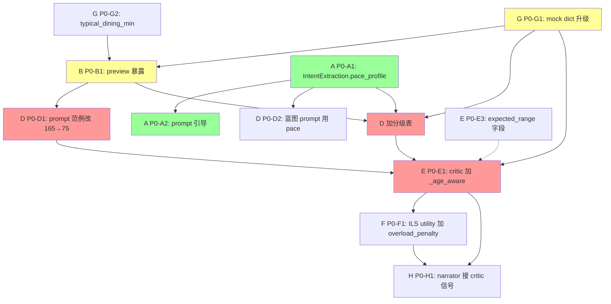

# Phase 3 跨环节依赖图与修复优先级（编排者汇总）

> 8 份 agent 报告 ~275KB / ~9 万字 / 25 子环节全覆盖，发现 P0/P1/P2 共 ~75 条 gap。
> 本文档把跨环节联动梳理成依赖图，排出修复优先级，作为 Phase 5 出 spec 的依据。
> **绝对约束**：本 Phase 仍只审查 + 写文档，不动代码。

---

## 一、所有 P0 gap 汇总（demo 立刻翻车级，22 条）

```text
| 编号  | gap 标题                                        | Agent | 直接根因？  |
|-------|------------------------------------------------|-------|-------------|
| P0-A1 | IntentExtraction schema 缺 pace_profile 节奏字段 | A     | ★★ 间接     |
| P0-A2 | BlueprintLLM 看不到 companions[].age（prompt 无引导） | A     | ★★★ 直接    |
| P0-A3 | Refiner 字典识别不到「太久/太长/盯不住」反馈     | A     | ★ demo 翻车 |
| P0-B1 | _poi_preview 漏 suggested_duration_minutes（铁证！）| B     | ★★★★ 直接    |
| P0-B2 | Restaurant 完全无 typical_dining_min            | B     | ★★ 间接     |
| P0-B3 | suggested_duration 没有「年龄段差异化」          | B     | ★★ 间接     |
| P0-C1 | graph 主路径漏注册 estimate_routes_worker        | C     | ★ 间接      |
| P0-C2 | LookupHop 与 EstimateRouteTime 同一对返不同语义  | C     | ★ 间接      |
| P0-D1 | BLUEPRINT_SYSTEM_PROMPT 范例 duration_min=165 反向锚定 | D | ★★★★ 直接    |
| P0-D2 | _poi_preview 漏 suggested_duration_minutes      | D     | (与 B1 同)  |
| P0-D3 | _duration_critic 上限 300min 太宽               | D     | ★★ 间接     |
| P0-E1 | 三套 critic 全无「同行人年龄→单段时长」感知     | E     | ★★★ 直接    |
| P0-E2 | 主路径「精确营业时间」承诺没落地                 | E     | ★ 间接      |
| P0-E3 | format_violations_for_llm 不给"期望区间"        | E     | ★★ 间接     |
| P0-F1 | ILS utility 无 overload_penalty                | F     | ★★ 兜底间接  |
| P0-F2 | DINING_SLOTS 硬编码与 rule 路径漂移             | F     | ★ 兜底间接   |
| P0-F3 | assemble _build_summary 取最长节点强化过长主活动 | F     | ★★ 间接     |
| P0-G1 | suggested_duration 单值不分年龄                  | G     | ★★★ 间接    |
| P0-G2 | Restaurant 无 typical_dining_min（与 B2 同）    | G     | ★★ 间接     |
| P0-G3 | POI 缺 energy_level / kid_friendly_intensity   | G     | ★ 间接      |
| P0-G4 | personas.notes 自由文本 pace_profile 信号埋没   | G     | ★ 间接      |
| P0-H1 | narrator 完全不质疑方案                         | H     | ★★ 间接     |
| P0-H2 | DONE payload 空 dict 丢失质量信号               | H     | ★ 评分项 2  |
```

## 二、根因聚类（5 因联动）

按"5 岁娃博物馆 2.5h"反例归因：

```text
[1] prompt 范例值 P0-D1（165min）→ in-context 锚定          权重 30%
[2] preview 漏字段 P0-B1/D2（suggested_duration）           权重 25%
[3] prompt 无年龄分级表 P0-A2（regulator level 缺失）       权重 20%
[4] critic 无单段年龄校验 P0-E1（兜底失守）                 权重 15%
[5] mock 数据单值不分年龄 P0-G1（信息源浑浊）               权重 10%
```

任何单点修复都不彻底。**业界共识**（TravelPlanner ICML 2024 + LLM-Modulo NeurIPS 2024）：必须 prompt 主防 + 数据信息源补 + critic 兜底**三层联动**。

## 三、依赖图（杠杆点 + 联动顺序）



## 四、最优修复顺序（高杠杆点先做）

### Wave 1：信息源 + Schema（高杠杆，前置依赖）—— 8h
```text
| 任务                                              | Agent | 工时   | 阻塞     |
|--------------------------------------------------|-------|-------|---------|
| W1.1 mock POI suggested_duration_minutes 升级 dict | G     | 3h    | -       |
| W1.2 mock Restaurant 加 typical_dining_min        | G     | 2h    | -       |
| W1.3 schemas/domain.py 同步 schema 升级            | G     | 1h    | W1.1+W1.2 |
| W1.4 IntentExtraction 加 pace_profile             | A     | 1.5h  | -       |
| W1.5 personas.json 加 default_pace_profile        | G+A   | 0.5h  | W1.4    |
```

### Wave 2：候选预览（让 LLM 看到字段）—— 1.5h
```text
| W2.1 _poi_preview 暴露 suggested_duration_minutes（按年龄桶投影） | B  | 0.5h | W1.1+A1 |
| W2.2 _restaurant_preview 暴露 typical_dining_min                | B  | 0.5h | W1.2    |
| W2.3 SearchPoisOutput 加 effective_distance_max_km             | B  | 0.5h | -       |
```

### Wave 3：主防（prompt 主路径）—— 1.5h
```text
| W3.1 BLUEPRINT_SYSTEM_PROMPT 范例改 165→75 + kind 改"看展" | D | 0.5h | -       |
| W3.2 prompt 加「按 companion age 分级时长表」（紧凑版 ~300 字符）  | D | 0.5h | W2.1     |
| W3.3 prompt cap 1500→2200，给业务规则段预留预算                 | D | 0.5h | -       |
```

### Wave 4：兜底（critic 兜底层）—— 4h
```text
| W4.1 blueprint critic 加 _age_aware_duration_critic        | E | 1h | W2.1+G1 |
| W4.2 critics_v2 加 AGE_DURATION_MISMATCH 镜像              | E | 1h | -       |
| W4.3 Violation schema 加 expected_range 字段              | E | 0.5h | -      |
| W4.4 critics_v2 加 _check_opening_hours_after_assemble    | E | 1h | -       |
| W4.5 critic message 全量回填 expected_range               | E | 0.5h | W4.3    |
```

### Wave 5：算法兜底 + ILS 对齐—— 3.5h
```text
| W5.1 ILS utility 加 overload_penalty 维度       | F | 1.5h | W4.1     |
| W5.2 DINING_SLOTS 改用 _resolve_time_window     | F | 0.75h | -       |
| W5.3 assemble buffer 按 companions 浮动         | F | 1h | W1.4     |
| W5.4 _build_summary 加业务合理性质疑文案          | F | 0.25h | -       |
```

### Wave 6：意图层 + Refiner—— 4.5h
```text
| W6.1 system_prompt 加「ages ≤6→single_session_max ≤90」规则 | A | 1h | W1.4     |
| W6.2 refiner_prompt 加 _KEYWORDS_SESSION_TOO_LONG          | A | 1.5h | W1.4    |
| W6.3 _extract_duration_from_feedback 扩半小时/分钟正则      | A | 0.5h | -        |
| W6.4 router Layer 3 阈值 + 启发式优化                       | A | 1h  | -        |
| W6.5 NodeDecider 升级为 NodePlanHint（含 suggested_min）    | A | 0.5h | W1.4    |
```

### Wave 7：narrator + 输出层—— 4h
```text
| W7.1 narrator prompt 接入 critic_attempts + violations         | H | 0.75h | W4.1   |
| W7.2 DONE event payload 加 6 字段总结                          | H | 0.25h | -      |
| W7.3 refiner_node 重置漏字段（critic_attempts/fallback/alt）  | H | 0.1h  | -      |
| W7.4 narrate_node 用 model_copy 替代 mutate                    | H | 0.15h | -      |
| W7.5 execute_finalize 全量遍历 restaurant + confirm narrator  | H | 0.5h  | -      |
| W7.6 state.routes 删除（死字段）                              | H | 0.1h  | -      |
| W7.7 LLM-based business_critic_node（meta-critic 节点）       | H | 2h    | W4.1   |
| W7.8 NodeDecision schema 字段                                | H | 0.25h | -      |
```

### Wave 8：通勤层（独立并行）—— 2h
```text
| W8.1 estimate_route_time 内部走 lookup_hop（统一调用栈）     | C | 0.5h | -       |
| W8.2 routes.json P×P / R↔R 矩阵补全（脚本生成）              | C | 0.75h | -      |
| W8.3 lookup_hop 注释「三级降级」改"四级降级"                  | C | 0.1h | -       |
| W8.4 lookup_hop 加反向边对称查询（轻量补丁）                  | C | 0.15h | -      |
| W8.5 graph 主路径补 estimate_routes_worker（OR：删 docstring）| C | 0.5h | -      |
```

**总时**：~28h（不含联调测试），分 8 个 Wave。**hackathon 时间盒下，建议按 P0 重要性砍到 W1+W2+W3+W4+W7 = ~19h**（ILS 兜底路径与意图层升级延后）。

---

## 五、目录重组建议综合（来自 8 份报告）

```text
agent/
├── core/                    ── 全员共享工具
│   ├── llm_client.py / llm_client_stub.py
│   ├── observability_init.py
│   ├── feedback_detector.py
│   ├── trace.py
│   └── prompts/             ── 共享 prompt
│
├── intent/                  ── 意图层（A/H）
│   ├── parser.py            (intent_parser.py)
│   ├── refiner.py
│   ├── router.py
│   ├── node_decider.py
│   ├── narrator.py
│   └── prompts/
│       ├── intent_parser_prompt.py  (拆 system_prompt.py)
│       ├── refiner_prompt.py
│       ├── router_prompt.py
│       └── narrator_prompt.py
│
├── planning/                ── 规划主路径核心（B/D/E/G）
│   ├── blueprint/
│   │   ├── blueprint.py
│   │   ├── blueprint_llm.py
│   │   ├── assemble_blueprint.py
│   │   └── prompts/
│   │       └── blueprint_prompt.py
│   ├── commute/
│   │   └── lookup_hop.py
│   ├── critic/
│   │   ├── critics_v2.py    (从 v2/ 搬来，去掉 v2 后缀)
│   │   ├── social_compat.py (跟 critic 一起搬)
│   │   └── meta_critic.py   (新增 H 方案 D)
│   └── weights_llm.py       (主路径已不消费，待评估冻结)
│
├── runtime/                 ── 运行时框架（H）
│   ├── react_agent.py       (v2/react_agent.py)
│   ├── output_types.py
│   ├── orchestrator.py
│   ├── conversation.py
│   ├── tool_provider.py
│   ├── deps.py / model_factory.py
│   └── tools/               (search_adapter.py)
│
├── graph/                   ── LangGraph 主路径（不动）
│   └── nodes/ + state / build / sse_adapter
│
└── legacy/                  ── 冻结模块统一隔离
    ├── planner_rule.py      (planner.py)
    ├── planner_hybrid.py    (改名 ils_planner.py)
    ├── planner_llm_first.py
    ├── llm_planner.py
    ├── critics_legacy.py    (critics.py，被 hybrid ILS 用)
    ├── ils_score_critic.py  (改名版)
    ├── executor.py          (旧 ReAct 路径)
    └── segment_decider.py   (兼容 alias)
```

**5 个核心改动**：
1. 砍 `v2/` 命名（critics_v2 / observability 是正式版，不是 v2）
2. 4 个 planner 平铺 → legacy/
3. critic 二份合一（旧的进 legacy/，新的进 planning/critic/）
4. system_prompt.py 拆为 intent_parser_prompt + react_planner_prompt
5. **不动 graph/**（已清晰且稳定运行）

**重组工时**：~6h（含 import 路径全量替换 + 测试回归）。

---

## 六、关键决策建议

### 1. 业务质量修复 vs 目录重组：**先质量后重组**

理由：
- 质量修复与 demo 风险直接相关（5 岁娃 2.5h）
- 目录重组工时大但收益是工程债清理，不直接提升 demo 演示力
- 重组后 import 路径全变，质量修复要重新适配——重复劳动

### 2. P0/P1/P2 拆 spec 还是合 spec？**拆**

- spec A: `planning-quality-deep-review` 含 W1-W7（业务质量主线）
- spec B: `agent-directory-restructure` 含目录重组（在 A 完结后启动）

### 3. P0 Hackathon 必修最小集（19h）

```text
W1.1 mock POI 升级 dict (3h)
W1.2 mock Restaurant typical_dining_min (2h)
W2.1 _poi_preview 字段透传（含年龄桶投影） (0.5h)
W2.2 _restaurant_preview typical_dining_min (0.5h)
W3.1 prompt 范例 165→75 (0.5h)
W3.2 prompt 加分级表 (0.5h)
W3.3 prompt cap 调高 (0.5h)
W4.1 blueprint critic 加 _age_aware (1h)
W4.2 critics_v2 镜像 (1h)
W4.3 Violation expected_range 字段 (0.5h)
W4.5 message 回填 expected_range (0.5h)
W5.1 ILS utility overload_penalty (1.5h)
W7.1 narrator 接 critic 信号 (0.75h)
W7.2 DONE payload 6 字段 (0.25h)
W7.3 refiner_node 重置漏字段 (0.1h)
W7.4 narrate_node model_copy (0.15h)
A1: IntentExtraction.pace_profile (1.5h)
W6.1 system_prompt 4 条规则 (1h)
W6.2 refiner SESSION_TOO_LONG 字典 (1.5h)
─────────────────────────────────────
小计：~16h（含联调测试 +3h ≈ 19h）
```

---

> Phase 3 完成；Phase 4（联合审查）由独立 agent 做对抗审查。
